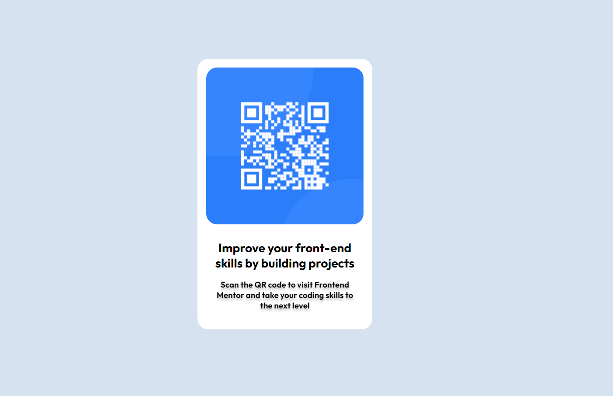

# Frontend Mentor - QR code component solution

This is a solution to the [QR code component challenge on Frontend Mentor](https://www.frontendmentor.io/challenges/qr-code-component-iux_sIO_H). Frontend Mentor challenges help you improve your coding skills by building realistic projects. 

## Table of contents

- [Overview](#overview)
  - [Screenshot](#screenshot)
  - [Links](#links)
- [My process](#my-process)
  - [Built with](#built-with)
  - [What I learned](#what-i-learned)
  - [Continued development](#continued-development)
  - [Useful resources](#useful-resources)
- [Author](#author)
- [Acknowledgments](#acknowledgments)

**Note: Delete this note and update the table of contents based on what sections you keep.**

## Overview

### Screenshot

### Links

- Solution URL: https://github.com/MirrorIce/frontendmentor-pjs/tree/main/qr-code-component
- Live Site URL: https://mirrorice.github.io/frontendmentor-pjs/qr-code-component/index.html

## My process

### Built with

- Semantic HTML5 markup
- CSS custom properties
- Flexbox

### What I learned

This project was more of a warm-up to get used with the Frontend Mentor way of doing things (gettings the files, uploading, etc.).
Funny enough, I didn't spot too many differences between the mobile and desktop, so the CSS was initially containing redundant styling.
One takeaway though would be that I'd prefer to have containers for sizing things, such as images and multiple paragaphs, in order to make it more consistent, rather than trying to style each of the individual elements.

### Continued development

The focus would be to go through the challenges and improve myself into observing the design and how to make a more efficient workflow

## Author

- Frontend Mentor - [@Mirrorice](https://www.frontendmentor.io/profile/MirrorIce)
